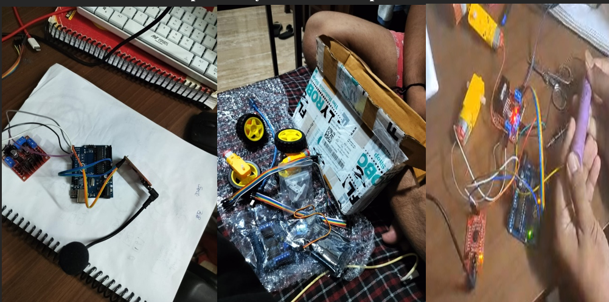
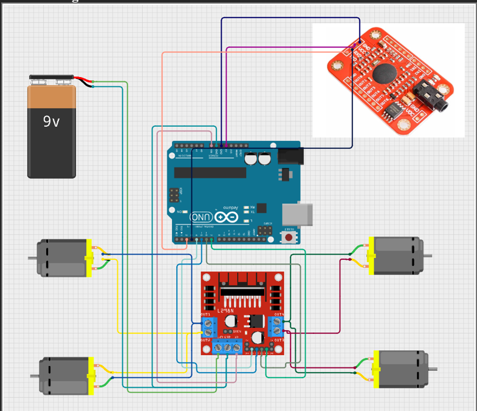
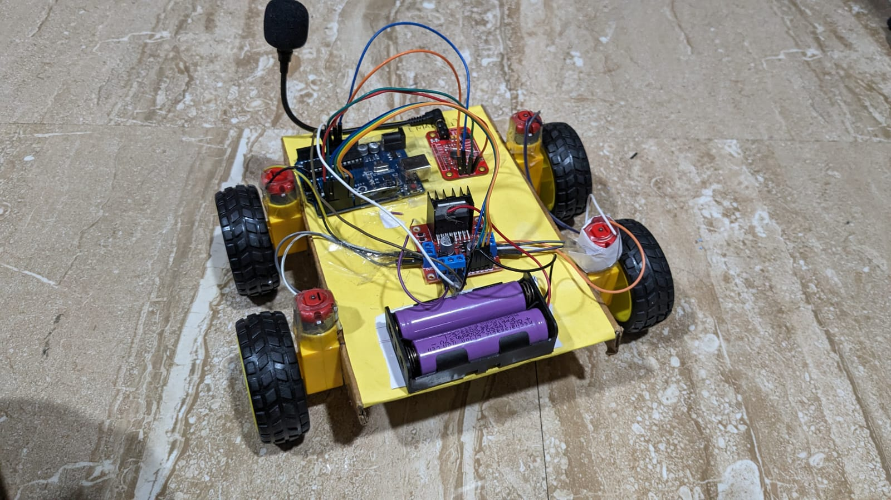

# Arduino Voice-Controlled Car

This project implements a voice-controlled car using an Arduino board and a Voice Recognition Module.

## Description
Description of the proposed Idea: 
The central idea is to harness voice recognition technology to facilitate a more inclusive and engaging play experience for small children and empower disabled patients lacking lower limb mobility. For children, the project aims to eliminate the dependence on electronic devices, allowing them to interact with toys through intuitive voice commands. Simultaneously, for disabled individuals, the technology can be adapted to motorized wheelchairs, offering an independent and dignified means of movement without requiring assistance.

Problem Statement:
In a world increasingly dominated by electronic devices, it becomes crucial to provide alternatives that cater to the needs of specific user groups, particularly children and differently-abled individuals. The challenge lies in developing a hands-free, intuitive control system that allows small children to interact with toys without relying on electronic gadgets such as phones or laptops. Simultaneously, this system should serve as a practical solution for disabled patients without lower limb mobility, empowering them to move around effortlessly in their wheelchairs without external assistance. The objective is to bridge the gap between traditional play and mobility aids, fostering inclusivity and accessibility through the integration of voice-controlled technology.

## Components Used

1. Arduino UNO..................................... https://amzn.to/3snznsa
2. Voice Recognition V3 Module......... https://amzn.to/335JZDf
3. L298n Motor Driver.......................... https://amzn.to/3JaLyzf
4. Gear Motors..................................... https://amzn.to/3Lhk6BL
5. Wheels............................................. https://amzn.to/3GBzYLP
6. 12 volt LED...................................... https://amzn.to/3LiaE0T
7. Wires............................................... https://amzn.to/3owIKVn
8. Jumper Wires................................. https://amzn.to/3rzH8vM
9. Screws and Nuts............................ https://amzn.to/3rwtny2
10. Electric Switch Board.................. 
11. Electric Switches......................... https://amzn.to/3rxByKk
12. 3.7 volt Batteries.........................  https://amzn.to/3gvEssP
13. Battery Holder............................. https://amzn.to/3grY80N

## Setup

1. Connect the Voice Recognition Module to the Arduino board according to the wiring diagram.
2. Upload the `voice_controlled_car.ino` sketch to the Arduino board.
3. Dounload the v3 library- https://github.com/elechouse/VoiceRecognitionV3
4. Power on the Arduino board and Voice Recognition Module.
5. Speak voice commands (e.g., "forward", "left", "stop") to control the car.

   

## Wiring Diagram

## Demonstration
click to see video

## Usage

1. Voice-Controlled Interaction for Children's Toys:
   - Designing a voice-controlled system that allows small children to effortlessly control their toys using simple voice commands. This eliminates the need for complex remote controls and enhances the play experience for young children.

2. Empowering Disabled Patients with Voice-Controlled Wheelchairs:
   - Implementing voice recognition technology in wheelchairs to provide a hands-free mobility solution for disabled patients without lower limb mobility. This innovation aims to offer independence by enabling them to move around easily without assistance.

3. Accessible Human-Robot Interaction:
   - Creating an accessible and inclusive human-robot interaction model that breaks down barriers for children and disabled individuals. This approach emphasizes simplicity and ease of use, fostering a sense of empowerment and freedom.

4. Customizable Voice Commands for Personalization:
   - Allowing users to customize voice commands based on their preferences, providing a personalized and tailored experience. This feature enhances adaptability for individual needs and preferences.

5. Educational Tool for Learning and Exploration:
   - Serving as an educational tool for children to learn about technology, voice recognition, and robotics in a playful and interactive manner. The project encourages curiosity and exploration in a safe and enjoyable environment.

6. Offline and Device Independence:
   - Ensuring the system operates offline without the need for external devices like phones or laptops. This feature promotes a self-contained and portable solution that doesn't rely on external electrical devices.

7. Promoting Independence and Self-Mobility:
   - Empowering disabled patients by providing them with a voice-controlled wheelchair solution. This technology promotes independence, allowing them to move freely without requiring constant assistance.

8. Humanitarian Impact:
   - Recognizing the potential humanitarian impact by improving the quality of life for children and disabled individuals. The project aims to contribute to a more inclusive and compassionate society through technological innovation.

## Credits

This project was created by Sanjay Sajnani and Manav Mehta.

